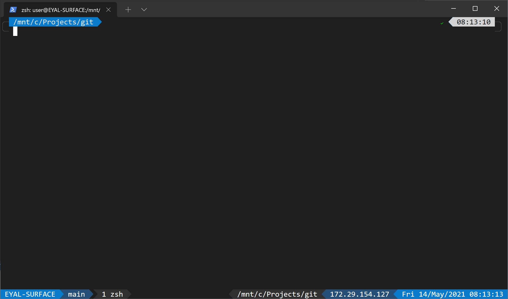

tmux-conf
=========

Screenshots
-----------


Installation
------------
* Install tmux:
```
sudo ./install.sh
```

* Add the following lines to your ~/.bashrc file for automatic activation:
```
printf "\e[?2004l"

if [[ -z "$TMUX" ]]; then
    if [ -z "$DISPLAY" ]; then
        echo "X DISPLAY not available"
    fi
    tmux a -t "main"
    if [ $? != 0 ]; then
        tmux new-session -s "main"
    fi
else
    export LS_COLORS="$LS_COLORS:ow=1;34:tw=1;34:"
fi
```

* Add the following lines to your ~/.bashrc file for automatic activation in remote sessions only:
```
printf "\e[?2004l"

if [[ -z "$TMUX" ]] && [ "$SSH_CONNECTION" != "" ]; then
    if [ -z "$DISPLAY" ]; then
        echo "X DISPLAY not available"
    fi
    tmux a -t "main"
    if [ $? != 0 ]; then
        tmux new-session -s "main"
    fi
else
    export LS_COLORS="$LS_COLORS:ow=1;34:tw=1;34:"
fi
```
